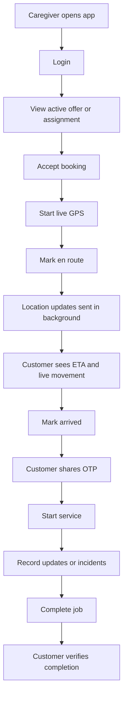

# LDERLY Caregiver Android App

This is the native Android foundation for the LDERLY caregiver app. It is intentionally separate from the existing Next.js customer/ops web app and uses the same backend APIs.

## Why This Exists

Browser GPS is not reliable enough for Uber-style caregiver movement because mobile browsers can pause location updates when the screen locks, the tab is backgrounded, or battery saver starts.

The caregiver app needs native Android background location so families can see:

- live caregiver movement
- ETA updates
- arriving soon state
- arrived state
- service OTP start
- job completion
- panic/SOS support

## Recommended Stack

- Expo React Native
- TypeScript
- Firebase Cloud Messaging later
- Existing LDERLY Next.js APIs
- Android foreground service for background location

## Initial Setup

```bash
cd mobile/caregiver-android
npm install
cp .env.example .env
npm run android
```

Set:

```env
EXPO_PUBLIC_LDERLY_API_BASE_URL=https://lderly-app.vercel.app
```

For local testing:

```env
EXPO_PUBLIC_LDERLY_API_BASE_URL=http://192.168.0.103:3000
```

Use your computer's LAN IP, not `localhost`, because the Android device/emulator cannot reach your laptop's localhost directly.

## Caregiver Workflow



## Existing Backend APIs Used

- `POST /api/auth/caretaker`
- `POST /api/bookings/{bookingId}/accept`
- `POST /api/bookings/{bookingId}/status`
- `POST /api/bookings/{bookingId}/start`
- `POST /api/caretaker/location`
- `POST /api/care-quality/vitals`
- `POST /api/care-quality/incident`
- `POST /api/voice-notes/upload-url`

## Android Permissions Needed

- fine location
- coarse location
- background location
- foreground service
- notifications

## Pilot Notes

For the first pilot, keep the flow simple:

1. Login
2. Accept assignment
3. Start live GPS
4. Mark en route
5. Mark arrived
6. Enter OTP
7. Complete job

Do not add heavy marketplace or payment screens to the caregiver app initially.

