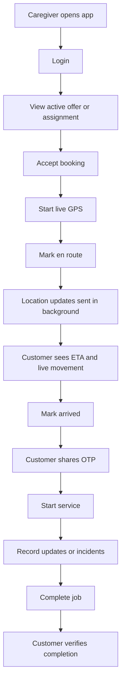

# LDERLY Caregiver Android App

This is the native Android foundation for the LDERLY caregiver app. It is intentionally separate from the existing Next.js customer/ops web app and uses the same backend APIs.

## Why This Exists

Browser GPS is not reliable enough for Uber-style caregiver movement because mobile browsers can pause location updates when the screen locks, the tab is backgrounded, or battery saver starts.

The caregiver app needs native Android background location so families can see:

- live caregiver movement
- ETA updates
- arriving soon state
- arrived state
- service OTP start
- job completion
- panic/SOS support

## Recommended Stack

- Expo React Native
- TypeScript
- Firebase Cloud Messaging later
- Existing LDERLY Next.js APIs
- Android foreground service for background location

## Initial Setup

```bash
cd mobile/caregiver-android
npm install
cp .env.example .env
npm run android
```

Set:

```env
EXPO_PUBLIC_LDERLY_API_BASE_URL=https://lderly-app.vercel.app
```

For local testing:

```env
EXPO_PUBLIC_LDERLY_API_BASE_URL=http://192.168.0.103:3000
```

Use your computer's LAN IP, not `localhost`, because the Android device/emulator cannot reach your laptop's localhost directly.

## Current Local Android Studio Status

This folder now includes a generated native Android project at:

```text
mobile/caregiver-android/android
```

Android Studio can open that folder directly.

On this machine:

- Android Studio is installed.
- Android SDK is installed at `C:\Users\jayan\AppData\Local\Android\Sdk`.
- Android NDK `27.1.12297006` has been installed after the first Gradle attempt.
- No Android emulator/AVD was configured when checked with `emulator -list-avds`.
- No physical Android device was visible when checked with `adb devices`.

To finish local device validation:

1. Open Android Studio.
2. Open `mobile/caregiver-android/android`.
3. Create an emulator from Device Manager, or connect an Android phone with USB debugging enabled.
4. Run the `app` configuration.

Useful temporary shell setup for Windows:

```powershell
$env:JAVA_HOME="C:\Program Files\Android\Android Studio\jbr"
$env:ANDROID_HOME="$env:LOCALAPPDATA\Android\Sdk"
$env:ANDROID_SDK_ROOT="$env:LOCALAPPDATA\Android\Sdk"
```

Build command:

```powershell
.\android\gradlew.bat -p android assembleDebug --console=plain
```

## Standalone APK Build

A standalone release APK was generated successfully on Windows from a short build path because React Native native builds can exceed Windows path limits inside the normal repo folder.

Use the release APK for direct phone testing. Debug APKs require Metro to be running and can show the `index.android.bundle` error when installed directly.

Repeatable build flow:

```powershell
$repo="C:\Users\jayan\Documents\Codex\2026-05-06\files-mentioned-by-the-user-lderly\mobile\caregiver-android"
$target="C:\lcg"
if (Test-Path $target) { Remove-Item -LiteralPath $target -Recurse -Force }
New-Item -ItemType Directory -Path $target | Out-Null
robocopy $repo $target /E /XD node_modules android .expo /XF *.log
cd $target
npm install
npx expo prebuild --platform android --clean --no-install
$env:JAVA_HOME="C:\Program Files\Android\Android Studio\jbr"
$env:ANDROID_HOME="$env:LOCALAPPDATA\Android\Sdk"
$env:ANDROID_SDK_ROOT="$env:LOCALAPPDATA\Android\Sdk"
.\android\gradlew.bat -p android assembleRelease --console=plain --no-daemon -PreactNativeArchitectures=arm64-v8a
```

APK output:

```text
C:\lcg\android\app\build\outputs\apk\release\app-release.apk
```

Shared copy in the main repo:

```text
share\lderly-caregiver-release.apk
```

## Caregiver Workflow



## Existing Backend APIs Used

- `POST /api/auth/caretaker`
- `POST /api/bookings/{bookingId}/accept`
- `POST /api/bookings/{bookingId}/status`
- `POST /api/bookings/{bookingId}/start`
- `POST /api/caretaker/location`
- `POST /api/care-quality/vitals`
- `POST /api/care-quality/incident`
- `POST /api/voice-notes/upload-url`

## Android Permissions Needed

- fine location
- coarse location
- background location
- foreground service
- notifications

## Pilot Notes

For the first pilot, keep the flow simple:

1. Login
2. Accept assignment
3. Start live GPS
4. Mark en route
5. Mark arrived
6. Enter OTP
7. Complete job

Do not add heavy marketplace or payment screens to the caregiver app initially.
